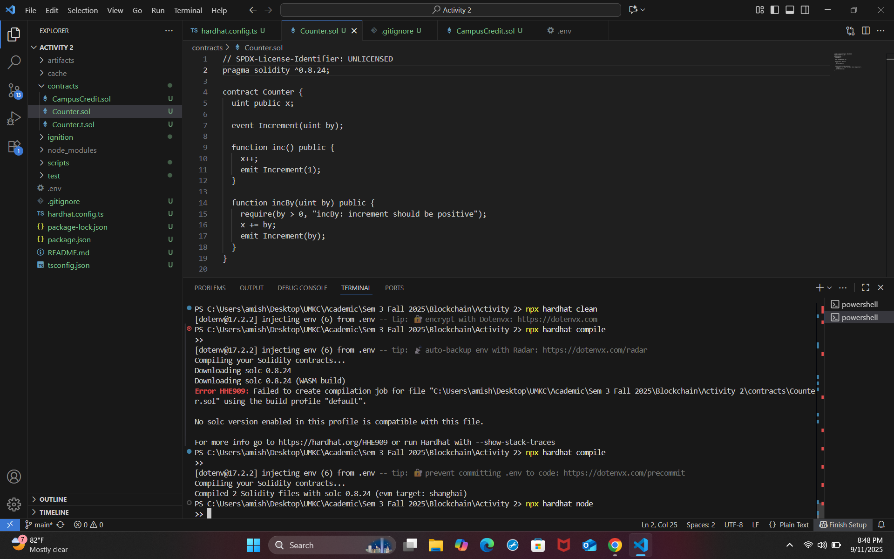
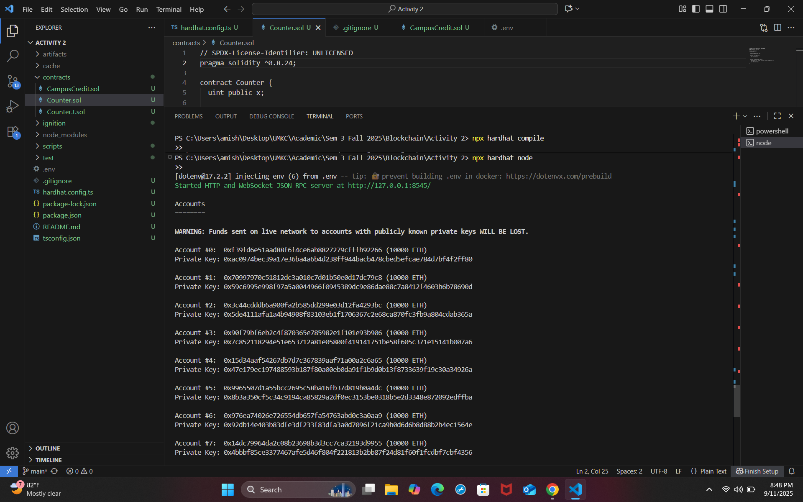
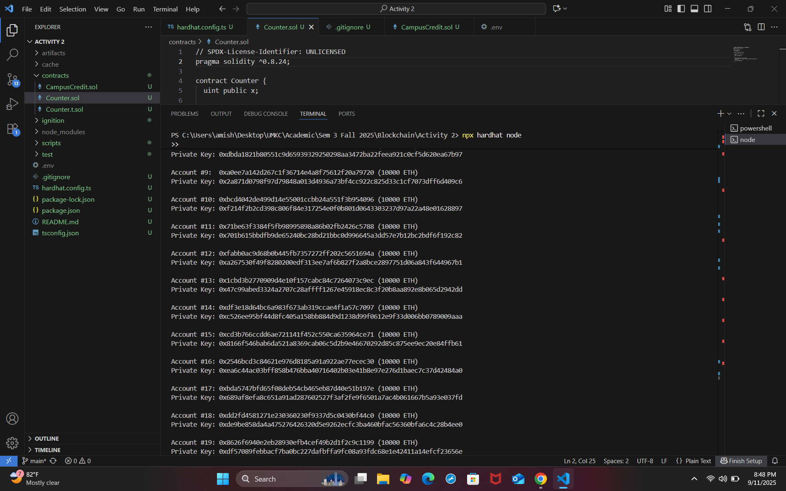
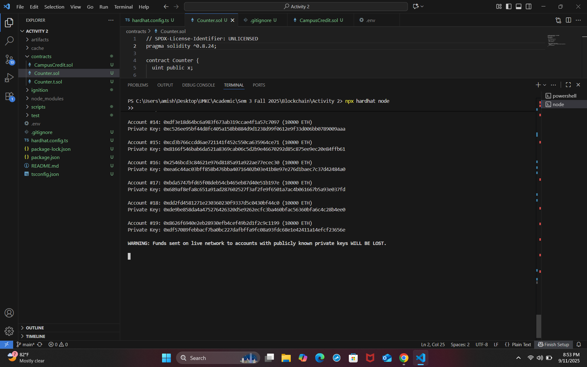
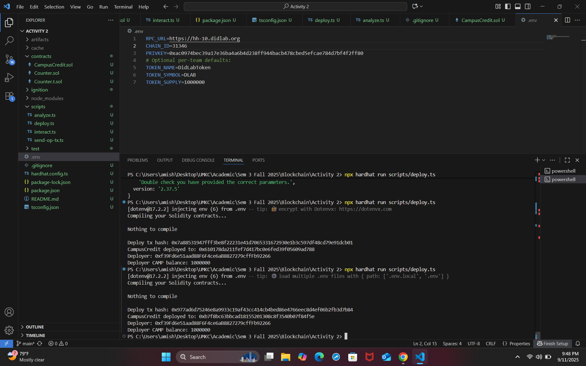
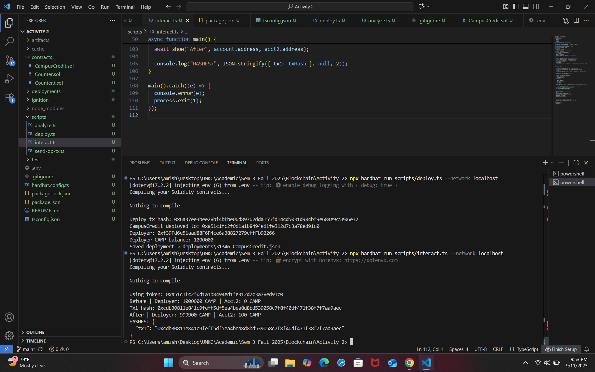
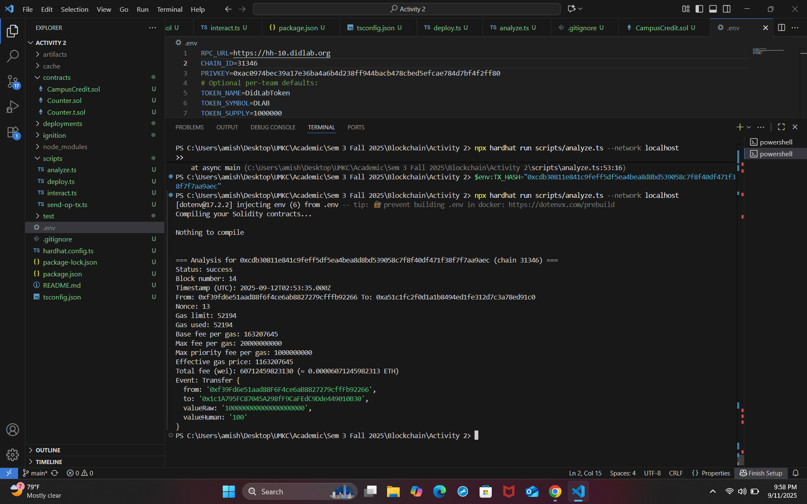

# Activity 2 — Hardhat (TypeScript + viem)

How to run:
1) npx hardhat compile
2) npx hardhat node
3) npx hardhat run scripts/deploy.ts --network localhost
4) npx hardhat run scripts/interact.ts --network localhost
5) npx hardhat run scripts/analyze.ts --network localhost

# Screenshots

