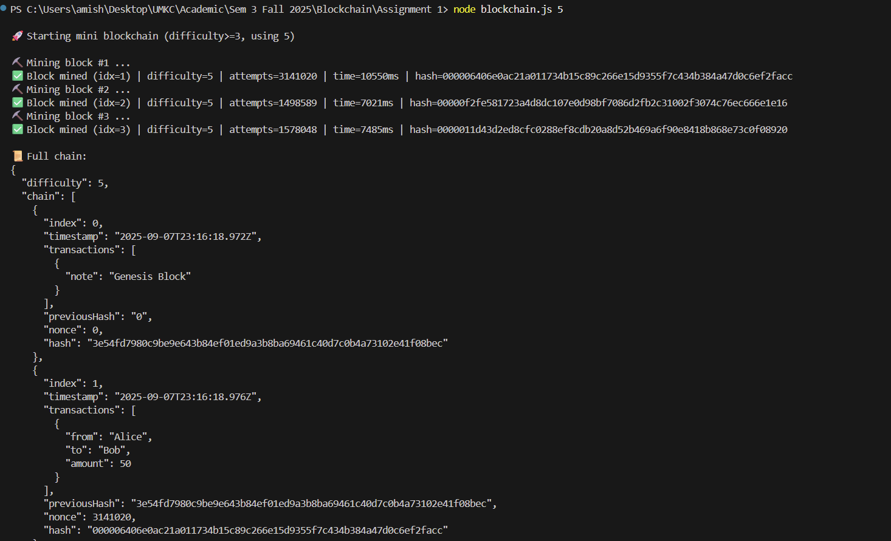
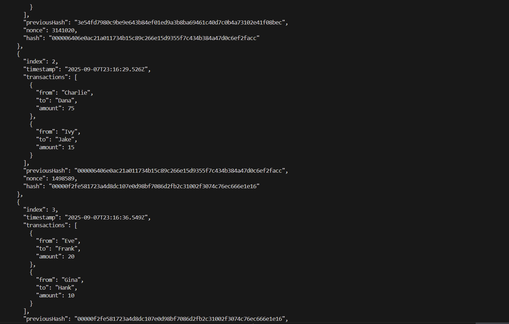
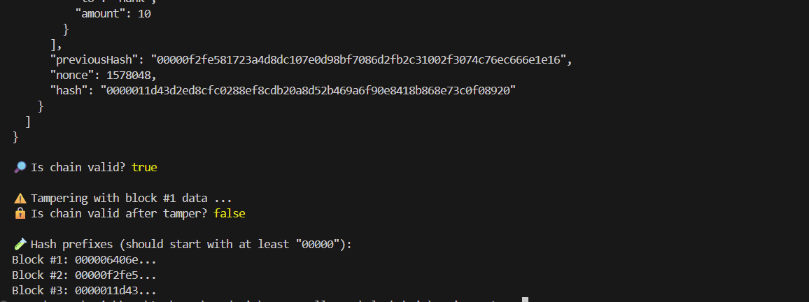

▶️ How to Run the Code

Save the code as blockchain.js in your project folder.

Open a terminal in that folder and run:

    node blockchain.js

This runs with the default difficulty of 3.
Or specify your own difficulty (minimum 3, higher = harder mining):

    node blockchain.js 5

The program will:

Mine 3 blocks with Proof-of-Work,

Print the full blockchain,

Validate the chain before and after tampering.

📸 Demo Explanation

The screenshots below show the mining process, blockchain state, and validation checks for the extended mini blockchain:

Mining Blocks
Each block is mined using Proof-of-Work. In my run with difficulty = 5, the hashes begin with five leading zeros (00000…). Mining required thousands to millions of nonce attempts, which is logged in the output. This demonstrates how difficulty directly affects the computation needed.

Transactions
Each block holds an array of transaction objects:

Block #1: Alice → Bob (50)

Block #2: Charlie → Dana (75), Ivy → Jake (15)

Block #3: Eve → Frank (20), Gina → Hank (10)
Together, the chain contains 5 transactions total, meeting the assignment requirement.

Blockchain Validation

Before tampering, validation shows:

Is chain valid? true

This confirms that all blocks are linked correctly and the hashes are consistent.

After modifying Block #1’s transaction (amount changed to 9999), the chain fails validation:

Is chain valid after tamper? false

This demonstrates immutability: even a tiny change breaks the chain’s integrity.

Hash Prefixes
At the end, the program prints the first few characters of each hash. Under difficulty 5, every block’s hash starts with at least 00000.

# Reflection 

(Q)What did you learn about hashing & immutability? 
-> Working through this assignment made the mechanics of hashing and immutability feel concrete. A hash function like SHA-256 compresses structured data (index, timestamp, transactions, previous hash, and nonce) into a fixed-size fingerprint. Because the fingerprint is highly sensitive, even a tiny change—like flipping one digit in a transaction amount—yields a completely different hash. Linking each block with the previous block’s hash creates a chain of dependencies: altering one block invalidates its own hash and the link from the next block, and so on. That is the essence of immutability in a blockchain—data is not unchangeable by magic, but any change becomes detectable because it breaks the cryptographic continuity.

(Q)Why does Proof-of-Work make blockchains secure? 
->Proof-of-Work (PoW) adds a computational cost to creating a valid block. By requiring a hash to start with a certain number of leading zeros (e.g., 000 for difficulty 3+), the miner must try many nonces before finding a valid one. This randomness makes it infeasible to cheaply rewrite history. If an attacker tampers with an early block, they must re-mine that block and all subsequent blocks faster than the honest network—an exponentially harder task as difficulty and chain length grow. Thus, PoW contributes to security by making attacks impractically expensive in time and energy, while honest verification remains cheap (simply recompute hashes and check prefixes).

(Q) What surprised you while coding this? 
->What surprised me most during coding was how simple the core loop is and how powerful the emergent property becomes. Incrementing a nonce and checking a prefix looks trivial, yet it transforms the ledger into a system where consensus favors the longest, most-worked chain. I also appreciated the importance of deterministic serialization (stable JSON ordering) for consistent hashing. Without it, logically identical objects could hash differently due to key order, causing false negatives. Overall, implementing PoW and validation clarified why blockchains are tamper-evident and why rewriting them is so costly in practice.
