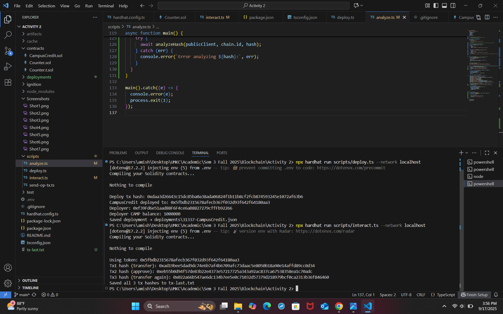

Part A — Deployment
• Contract address, symbol, decimals, initial supply (human & raw).
• Compiler version (0.8.24) & scripts used

Part B — Transaction Details (tx1/tx2/tx3)
• Status, block, timestamp (UTC).
• From / To (EOA vs contract).
• Nonce, gas limit, gas used.
• Base fee, max fee, max priority fee.
• Effective gas price, total fee (wei).
• Events: list Transfer/Approval with raw values + human conversions (18 decimals)

Part C:

Tx1 & Tx2 landed first (block 3), Tx3 later (block 4).

Tx1 & Tx2 had higher effective gas price (1676306405 vs 1590236065).

Priority tip was the same (1 gwei).

EIP-1559 = Base fee adjusts dynamically + user adds a priority tip → effective gas price = base fee + tip.

Part D:

Example: Tx1 Transfer = raw 100000000000000000000 = 100 tokens human-readable (divide by 1e18)