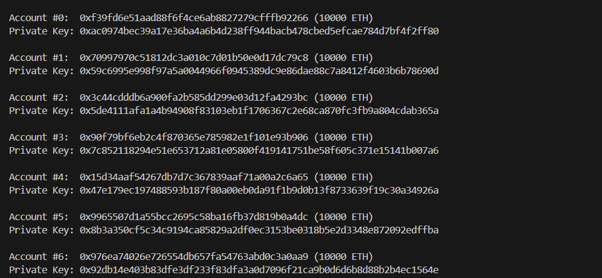
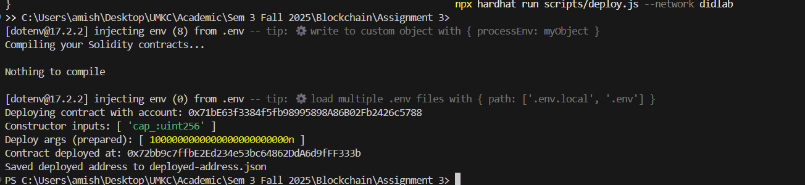
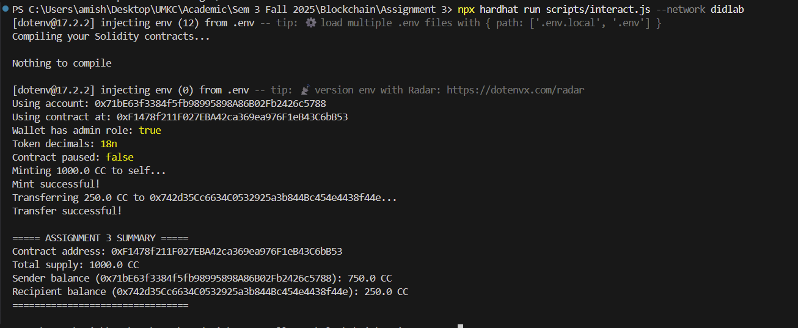

# Short write up
a. Where you enforced: cap, pause, roles

Cap enforcement:
The maximum supply of tokens is enforced using ERC20Capped. During the _mint function, the contract prevents minting more than the defined cap (TOKEN_CAP) to maintain a fixed total supply.

Pause enforcement:
Using ERC20Pausable, the contract allows certain roles to pause all token transfers. When the contract is paused, _beforeTokenTransfer blocks any transfers or mints until unpaused.

Roles enforcement:
With AccessControl, different roles (e.g., DEFAULT_ADMIN_ROLE, MINTER_ROLE, PAUSER_ROLE) are defined. Only addresses with the appropriate role can perform privileged operations like minting new tokens or pausing the contract.

b. Why batch airdrop saved (or didn’t save) gas in your data

Batch airdrop: Instead of sending tokens to each address individually (separate transaction per recipient), batch airdrop sends multiple transfers in a single function call.

Gas savings:

Saved gas: Fewer transactions means fewer base transaction costs (21000 gas per tx) and reduced repeated contract call overhead.

Didn’t save much: If the batch array is very large, gas usage per call increases linearly with the number of recipients, which may approach the block gas limit. Therefore, for very large lists, batch airdrop may not be significantly cheaper.

In practice, for moderate batch sizes, batch airdrop reduces gas compared to individual transfers.

c. Any issues you hit and how you fixed them

Multiple inheritance conflicts:

Issue: Solidity threw errors like _mint and _beforeTokenTransfer must override multiple base contracts (ERC20, ERC20Capped, ERC20Pausable).

Fix: Explicitly overrode these functions in CampusCreditV2 and called super._mint() or super._beforeTokenTransfer() in the correct order to satisfy Solidity.

Environment variables not set:

Issue: Deployment scripts failed because RPC_URL, PRIVATE_KEY, or TO address wasn’t set in .env.

Fix: Added all required variables in .env and ensured no extra spaces.

Local RPC not running:

Issue: ECONNREFUSED 127.0.0.1:8545 during deployment.

Fix: Started a local blockchain node (Hardhat or Ganache) before running scripts.

Constructor arguments mismatch:

Issue: Error: incorrect number of arguments to constructor when deploying.

Fix: Passed the correct constructor arguments (like TOKEN_CAP) in the deploy script.