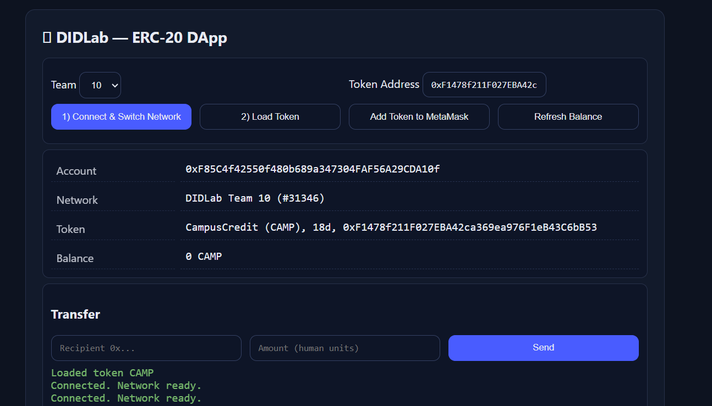

## RPC_URL=https://hh-10.didlab.org
## CHAIN_ID=31346
## Token Address: 0xF1478f211F027EBA42ca369ea976F1eB43C6bB53

Shortnote:
Extra Safety Checks / UX Touches:

Validated Ethereum addresses before sending tokens using getAddress() to prevent invalid transactions.

Automatically refreshed the user’s balance after transfers and minting by watching the Transfer event in publicClient.watchContractEvent().

Color-coded logs (ok, warn, err) in the UI for better user feedback.

Persisted selected team and token address in localStorage for convenience across sessions.

Issues Encountered & Fixes:

Problem: The name() and symbol() contract calls initially returned 0x/empty values.
Fix: Ensured the correct deployed contract address was used in the input box, and the MetaMask network matched the deployment.

Problem: MetaMask displayed 0 token balance even after minting via scripts.
Fix: Used the Transfer event watcher and refresh() function in the UI to update balances immediately.

Problem: Node.js ESM import errors when testing scripts with viem.
Fix: Installed viem locally and set "type": "module" in package.json
