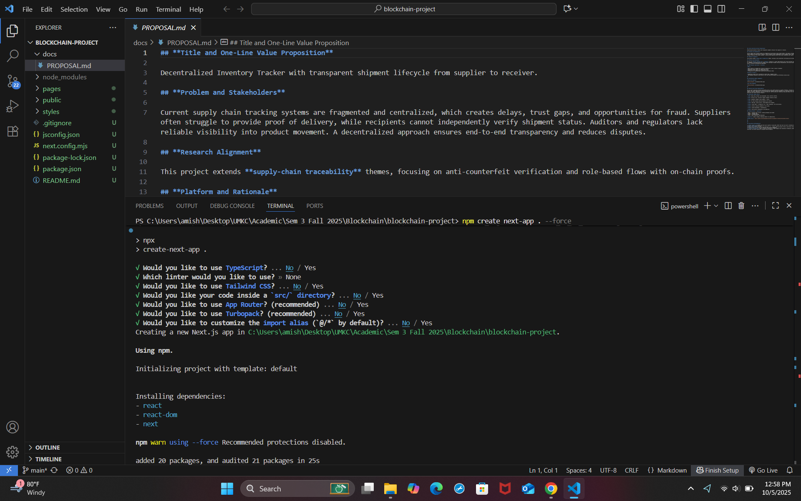
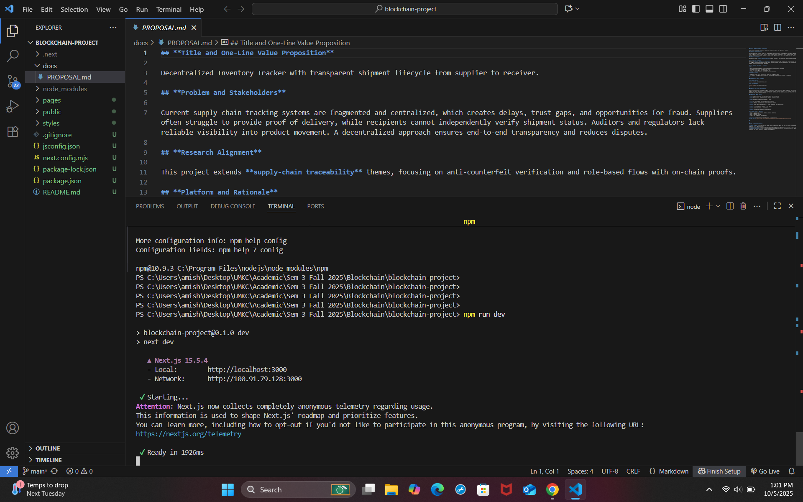
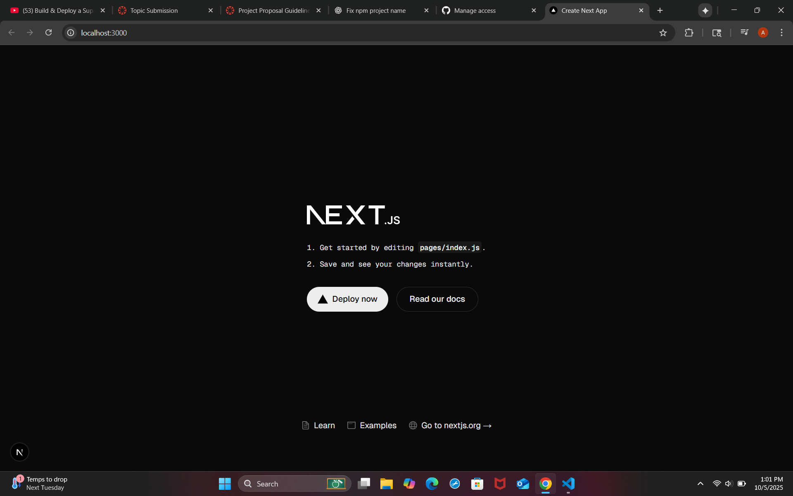
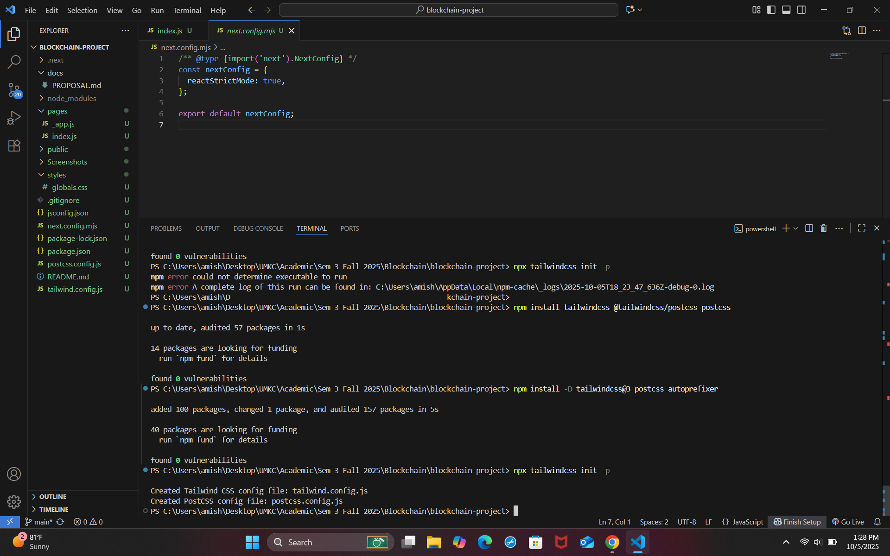
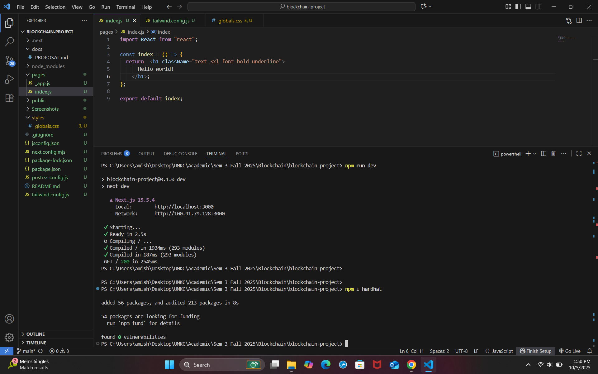
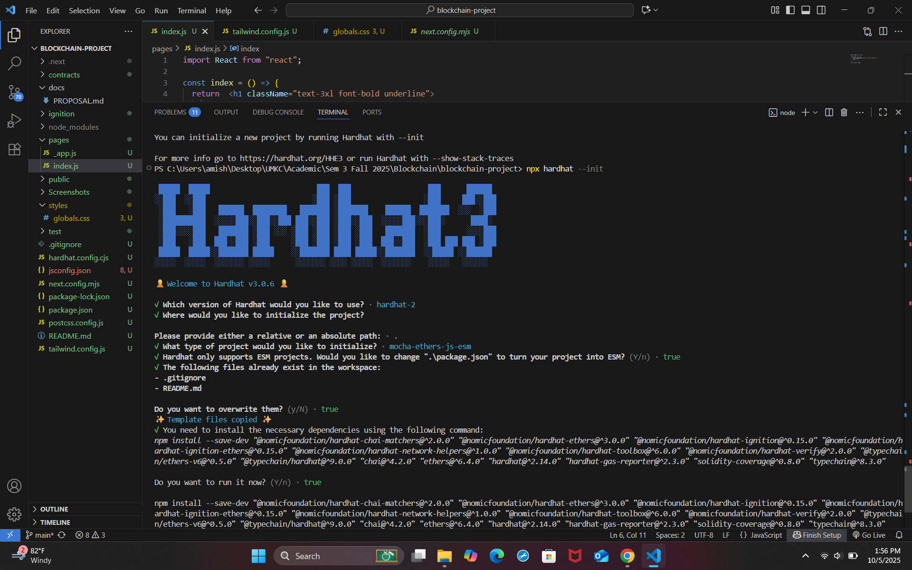
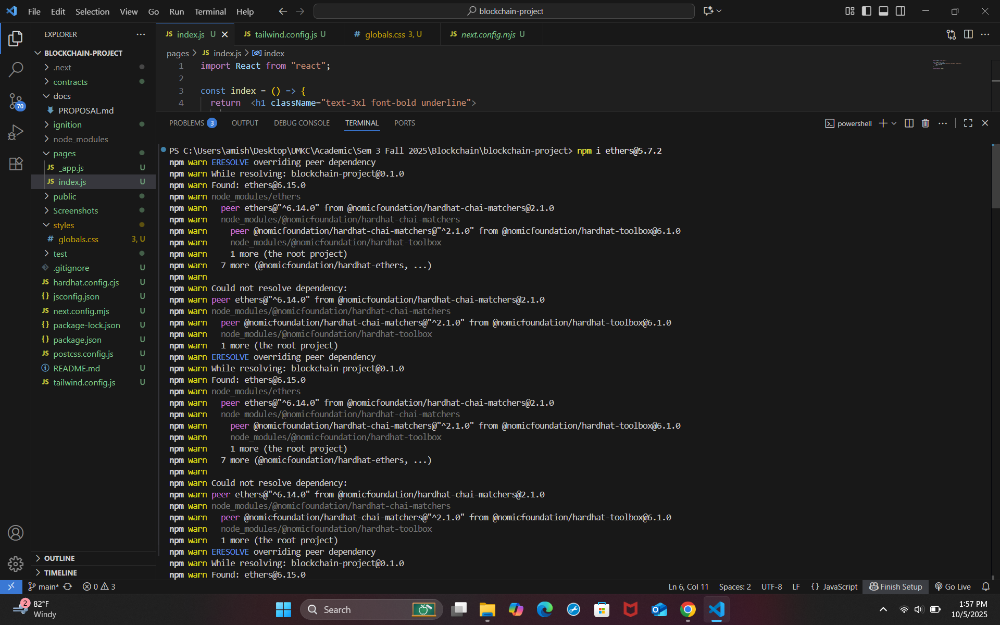
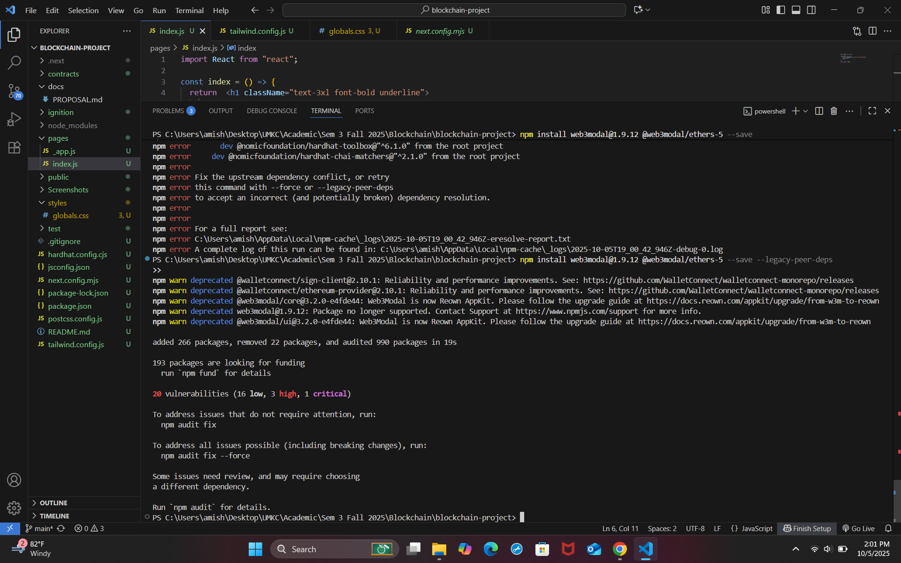
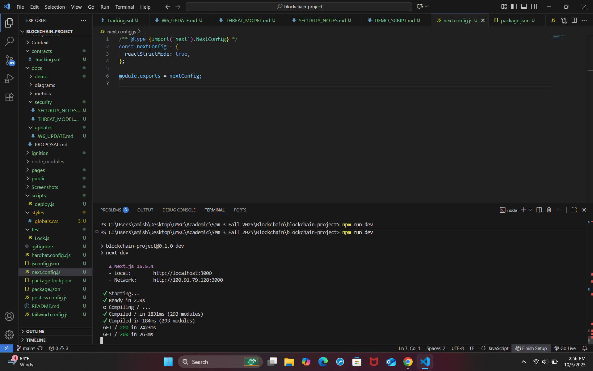

# 📦 Supply Chain DApp  

**Team:** Immutables  

---

## 🚀 Local Run Instructions  

### 1. Clone Repository  
git clone https://github.com/<your-username>/<repo-name>.git  
cd <repo-name>

### 2. Install Dependencies  
npm install

### 3. Run Local Blockchain  
npx hardhat node

### 4. Deploy Contract Locally  
npx hardhat run scripts/deploy.js --network localhost

### 5. Run Frontend  
npm run dev

Now open the app in your browser at 👉 [http://localhost:3000](http://localhost:3000/)

---

## 🧪 Run Tests  
npx hardhat test

### Example Output  
Tracking Contract  
✓ should deploy correctly  
✓ should create and fetch shipment

## **Local Run and Screenshots**

Making a small Change to trigger CI Pipeline - prnv

