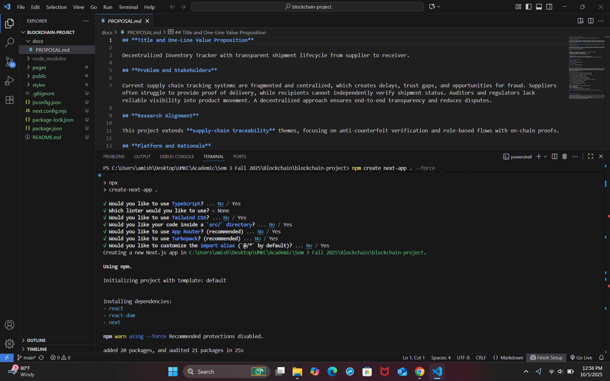
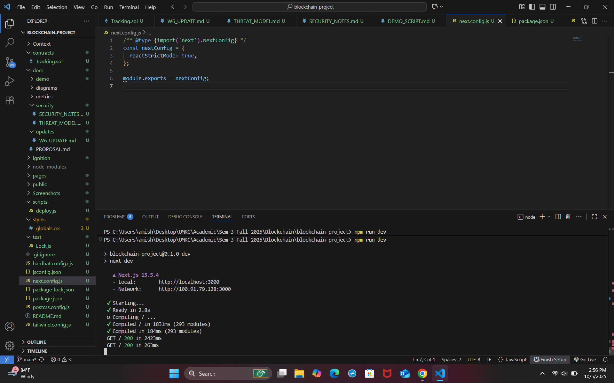

# 📌 Week 6 Progress Update  

**Team:** Amish, Pranav, Lahari, Priya  
**Date:** October 6, 2025  

---

## 📊 Weekly Rubric Breakdown  

### ✅ Progress  
- Initialized **Next.js** app and verified successful build at [http://localhost:3000](http://localhost:3000).  
- Installed and configured **Tailwind CSS** for frontend styling.  
- Initialized **Hardhat** for Solidity smart contract development.  
- Installed blockchain dependencies: **Ethers.js, Web3Modal, and Hardhat Toolbox**.  
- Verified **“Hello World”** page render with Tailwind styling.  
- Completed basic **repository structure** and **documentation setup**.  

---

### 📁 Evidence  
- **Screenshots attached** in `docs/updates/W6_UPDATE.md`:  
  - Next.js initialization and local build output.  
  - Tailwind CSS installation logs.  
  - Hardhat initialization and dependency installations.  
  - Local frontend run confirmation and terminal output.  

- **Repository:** [https://github.com/amishpandya/blockchain-assignments/tree/main/blockchain-project](https://github.com/amishpandya/blockchain-assignments/tree/main/blockchain-project)    

---

### 🔬 Technical Depth  
- Integrated multiple frameworks: **Next.js (Frontend)**, **Hardhat (Blockchain)**, and **Tailwind CSS (Styling)**.  
- Configured environment for **Solidity compilation** and **blockchain testing**.  
- Understood **Web3 integration process** and handled dependency version conflicts.  
- Prepared foundation for **smart contract deployment** and **CI testing**.  

---

### 🎯 Next Plan  
- Write and deploy first version of **Tracking.sol**.  
- Implement **CI workflow** for automatic testing.  
- Begin **wallet connection integration** with Web3Modal.  

---

### 🤝 Collaboration  
- **Amish:** Repository setup, Hardhat configuration, and screenshots.  
- **Pranav:** CI testing, Tailwind CSS styling.  
- **Lahari:** Dependency management and test environment setup.  
- **Priya:** Frontend build verification, W6 report creation, and markdown updates.  

✅ Team verified all setups across individual systems for consistency.  

# **User Stories**

## **MVP (Must-Have)**

1. Create Shipment – Supplier creates shipment with receiver address, distance, and price.

2. Track Shipment – Receiver views shipment details.

3. Start Shipment – Supplier marks shipment as *In Transit*.

4. Complete Shipment – Receiver confirms delivery and releases payment.

5. View All Shipments – User sees all shipments.

6. Connect Wallet – User connects MetaMask wallet.

## **Stretch Goals**

1. Payment Escrow – Funds held until shipment completion.

2. Shipment Ratings – Users rate experience.

3. Analytics Dashboard – Shows shipment metrics.

# **Docs/Updates**

**File:** docs/updates/W6 UPDATE.md

Include:

* CI screenshot (green)

* Terminal output from local run

* Link to PR

* Link to project board

Screenshots:

