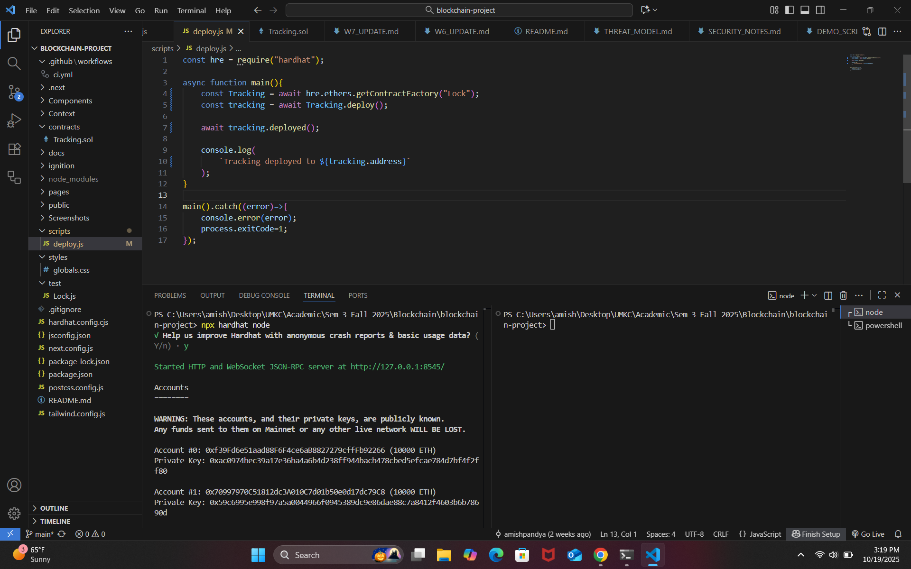

# **Week 8 Progress Update**

**Team:** Amish, Pranav, Lahari, Priya  
**Date:** October 20, 2025  

---

## 🧭 **Objective**

> First core feature completed and observable via blockchain events and logs.

---

## 📊 **Weekly Rubric Breakdown**

### **Progress**

- ✅ Completed deployment and verification of `tracking.sol` on local **Hardhat blockchain**.  
- 🧰 Configured **deploy script** to use contract name `tracking` and removed unused constructor arguments.  
- ⚙️ Initialized local blockchain via `npx hardhat node`, producing **20 funded test accounts** for wallet import.  
- 🚀 Executed local deployment with:  
  `npx hardhat run scripts/deploy.js --network localhost`  
- 📍 Captured generated **contract address** and verified contract artifact and ABI under:  
  `artifacts/contracts/tracking.json`  
- 🧠 Built **React Context layer** (`context/tracking.js`) to bridge blockchain and frontend using:  
  - `ethers.js` for contract interaction  
  - `Web3Modal` for wallet connection  
  - React **Context API** for app-wide state management  
- 🔄 Implemented asynchronous client functions for end-to-end state mutation:  
  1. **createShipment()** — writes on-chain shipment data, emits `ShipmentCreated`  
  2. **startShipment()** — updates status, emits `ShipmentInTransit`  
  3. **completeShipment()** — triggers Ether transfer, emits `ShipmentDelivered` and `ShipmentPaid`  
  4. **getAllShipments()**, **getShipmentCount()** — retrieve and map on-chain arrays  
  5. **connectWallet()**, **checkWalletConnection()** — validate Metamask connection state  
- 🌐 Configured **context provider** in `pages/app.js` for global DApp access.  
- 🧩 Created foundational React components in `/components/`:  
  `Navbar`, `Footer`, `Form`, `Table`, `GetShipment`, `CompleteShipment`, `StartShipment`, and supporting UI assets (SVG icons).  
- 🧪 Verified frontend build with `npm run dev` at `http://localhost:3000`, ensuring no missing imports or render errors.

---

### **Feature Verification (Core Flow)**

**Trigger:** Client executes `createShipment()` from React Context.  
**Action:** Transaction mined on **local blockchain (Hardhat Network)**.  
**Observable State:**  
- Event log shows `ShipmentCreated(address sender, address receiver, uint price, ...)`.  
- Shipment data verified via `getAllShipments()` in console output.

**End-to-End Path:**  
*Next.js Client → Ethers.js (via Context) → Smart Contract → State Change → Event Log → Console/UI feedback*

---

### **Evidence**

- 📜 Deployment logs showing **contract address** and **network**  
- 🧾 Console logs of event emissions: `ShipmentCreated`, `ShipmentInTransit`, `ShipmentDelivered`  
- 💻 Terminal output and screenshots stored in `docs/updates/W8_EVIDENCE.md`  
- 🧩 Updated architecture diagram: `docs/diagrams/week8_contract_context.png`  
- 🔗 **Source Repository:** [GitHub – blockchain-project](https://github.com/amishpandya/blockchain-assignments/tree/main/blockchain-project)

---

### **Technical Depth**

- Demonstrated **full local blockchain lifecycle:** node initialization, contract compilation, deployment, ABI linkage  
- Implemented **Context-based state management** for real-time contract data sync with frontend logic  
- Used **async/await** and `try/catch` for safe transaction flow  
- Added **input validation** for wallet and Ether amount checks  
- Designed **reusable hooks** for event-driven UI updates in future modules  
- Extended repository with detailed provider setup and documentation for contract binding  

---

### **Tests**

| Test Case | Description | Expected Result |
|------------|--------------|-----------------|
| **Test 1 (Happy Path)** | `createShipment()` emits event | Verified via `console.log()` and UI listener |
| **Test 2 (Read Path)** | `getAllShipments()` returns array | Properly mapped and displayed |
| **Test 3 (Negative Case)** | Invalid payment amount | Triggers revert `"Payment amount must match the price"` |

---

### **Acceptance Criteria Validation**

- ✅ End-to-end flow verifiable from client → blockchain  
- ✅ Events visible in console and Hardhat logs  
- ✅ Invalid transactions correctly rejected via revert message  

---

### **Next Plan**

- 🧱 Build UI components for **shipment creation and tracking** with live updates  
- 📡 Integrate **event subscription** for real-time shipment status in the frontend  
- 🧩 Extend **test suite** to cover all contract functions and edge cases  
- 📝 Update `README.md` with usage, wallet setup, and run instructions  

---

### **Collaboration**

| Team Member | Contributions |
|--------------|---------------|
| **Amish** | Contract deployment, context logic, Hardhat verification |
| **Pranav** | Error handling, test design, event capture |
| **Lahari** | Component structure, icons integration |
| **Priya** | README, documentation, validation logs |

> ✅ The team validated **full contract–client roundtrip** on a shared local network.

---

✅ **End of Week 8 Report**
